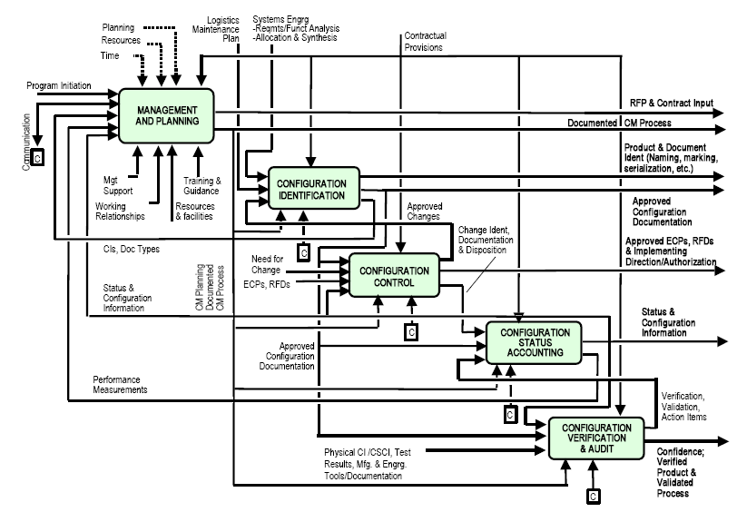
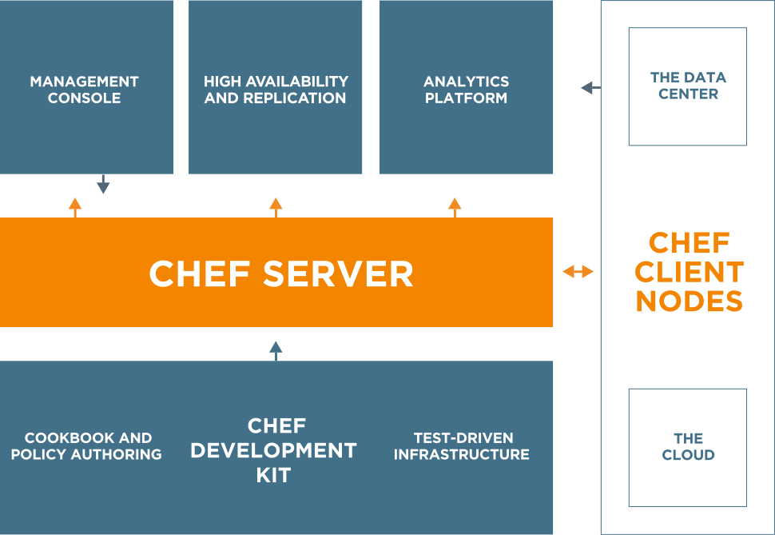

# Chef Introduction

学习Chef之前，先了解Software Configuration Management，简称SCM。SCM是软件工程中如何跟踪和管理软件变化的技术。SCM概念最初来自于美国军事领域：

> Configuration management (CM) is a systems engineering process for establishing and maintaining consistency of a product's performance, functional and physical attributes with its requirements, design and operational information throughout its life. The CM process is widely used by military engineering organizations to manage complex systems, such as weapon systems, vehicles, and information systems.

下图是最上层的配置管理活动模型：

随着系统越来越复杂，除了要保证交付质量，通常还面临需求变化、开发时间不充足、人员素质技能有差别等挑战，所有的挑战决定了需要采用系统化的方法来保证整个工程开发过程的顺利进行。这就是CM和SCM诞生的原因。

SCM的目的包括：

* Configuration identification - Identifying configurations, configuration items and baselines.
* Configuration control - Implementing a controlled change process. This is usually achieved by setting up a change control board whose primary function is to approve or reject all change requests that are sent against any baseline.
* Configuration status accounting - Recording and reporting all the necessary information on the status of the development process.
* Configuration auditing - Ensuring that configurations contain all their intended parts and are sound with respect to their specifying documents, including requirements, architectural specifications and user manuals.
* Build management - Managing the process and tools used for builds.
* Process management - Ensuring adherence to the organization's development process.
* Environment management - Managing the software and hardware that host the system.
* Teamwork - Facilitate team interactions related to the process.
* Defect tracking - Making sure every defect has traceability back to the source.

SCM的工作内容包括但不仅限于：

* 需求管理
* 代码版本管理
* 持续集成：构建、自动化测试、打包
* 部署管理
* 软件配置项（参数）管理
* 开发环境、测试环境、生产环境的管理
* OS、App运行情况监控

Chef主要专注于系统基础设施管理。通过Chef，可以自动化的构建、部署、管理基础设施。让基础设施变得可版本化、可测试、可复制。

> Chef turns infrastructure into code. With Chef, you can automate how you build, deploy, and manage your infrastructure. Your infrastructure becomes as versionable, testable, and repeatable as application code.
> 
> Chef server stores your recipes as well as other configuration data. The Chef client is installed on each server, virtual machine, container, or networking device you manage—we’ll call these nodes. The client periodically polls Chef server latest policy and state of your network. If anything on the node is out of date, the client brings it up to date.
> 
> 

# Learning Resource

* [Learn Chef](https://learn.chef.io/)
* [Chef Skill Library](https://learn.chef.io/skills/)
* [Chef Documents](https://docs.chef.io/)

# Book

* ***Automation through Chef Opscode*** - Navin Sabharwal and Manak Wadhwa
* ***Chef Essentials*** - John Ewart
* ***Test-Driven Infrastructure with Chef*** - Stephen Nelson-Smith

# Refercence

- [软件配置管理-百度百科](http://baike.baidu.com/view/922836.htm)
- [Configuration Management](https://en.wiki2.org/wiki/Configuration_management)
- [Software Configuration Management](https://en.wiki2.org/wiki/Software_configuration_management)
- [Comparison of open-source configuration management software](https://en.wiki2.org/wiki/Comparison_of_open-source_configuration_management_software)