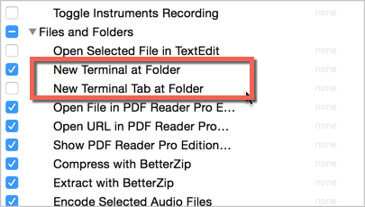

## Macbook OS X Yosemite快捷键？

- [OS X键盘快捷键](https://support.apple.com/zh-cn/HT201236)
- 打开System Preferences ->  Keyboard -> Shortcuts查看

## 如何在Finder右键菜单中直接打开Shell？
- 通过Automator创建一个Service，参考[open-shell-at-selected-folder-via-automater-service](http://blog.xcodev.com/archives/open-shell-at-selected-folder-via-automater-service/)
- 通过菜单Finder -> Services->Services Preferences，找到"Files and Folders"下的"New Terminal xxx"并勾选上

## Windows和Mac OS X的一些区别？

- [Mac的基础知识](http://www.apple.com/cn/support/macbasics/)
- [切换 101：在 Windows 上，我常常……](https://support.apple.com/zh-cn/HT2514)
- [Windows系统与Mac系统的简单区别](http://wiki.blueidea.com/index.php?title=Windows系统与Mac系统的简单区别)

## MacOS有哪些好用的SSH客户端？

参考：http://www.zhihu.com/question/20541129
据调查，最好掌握[iTerm2](https://www.iterm2.com/index.html)和[tmux](http://tmux.sourceforge.net/)。

## MacOS建议使用什么包管理工具？

[Homebrew](http://brew.sh/)

## 如何配置Mac开发环境？

参考：[Mac开发配置手册](https://www.gitbook.com/book/aaaaaashu/mac-dev-setup/details)
