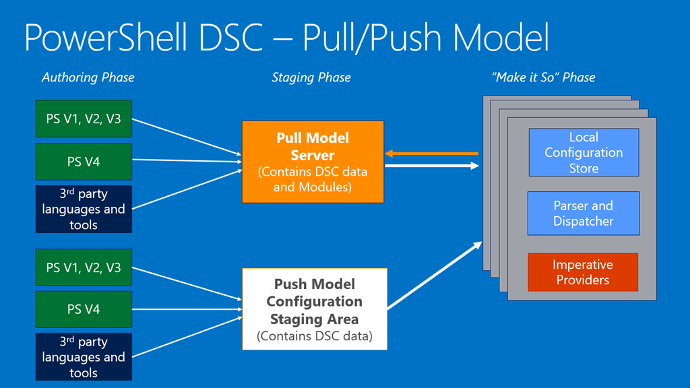

# 说明

这个repository中的内容包括我学习PowerShell过程中，浏览过的文章、书籍、学习视频、学习过程中写的一些练习脚本。通过系统化的记录学习的内容，希望能够加深对各种知识理解。

网络上的已经有很多关于PowerShell的文章和教程，但是过于分散，而且PowerShell发展比较快，也使很多文章和教程不能涵盖PowerShell最新的发展。所以决定把学习的内容记录下来。

建议把这个文章当作一个学习笔记或者手册，而不要当作一个教程。写教程需要花费更多的时间和精力，我比较懒，只希望花最少的时间掌握PowerShell，所以不想花太多时间在书写教程这件工作上。

希望能对你学习PowerShell有所帮助。

备注：[windows-command-line-utilities.md](./windows-command-line-utilities.md)是一些常用的windows命令行命令和工具的用法。

# PowerShell Introduction

Please read [PowerShell-Wikipedia](https://en.wiki2.org/wiki/Windows_PowerShell) first. Following is the contents:

1. Background
1. Design: cmdlet，pipeline，scripting，hosting
1. Versions：1.0，2.0，3.0，4.0，5.0
1. Comparison of cmdlet with similar commands
1. File extensions
1. Application Support
1. Alternative implementation

# Advantages

- 语言本身：
    - 丰富的命令（或者功能），以及扩展性
    - 管道机制，功能倍增器
    - 语法是否简单，完备：比如是否支持变量、函数、分支、循环、异常处理、闭包等等
    - 方便易用的帮助，比如man，get-help
- 其它方面：
    - 和Shell集成：反面的例子比如cscript.exe上执行的VBScript和Jscript
    - 包管理机制（类似Chocolatey，OneGet，APT-GET，homebrew），这方面期待powershell 5.0推出的OneGet
    - 互操作性（interoperable）：比如.NET程序中执行PowerShell脚本
    - 广泛的支持（SQL Server，Exchange Server等）

# Learning Videos

## Getting Started with PowerShell 3.0 Jump Start

### URL
- [Getting Started with PowerShell 3.0 Jump Start](https://www.microsoftvirtualacademy.com/en-US/training-courses/getting-started-with-powershell-3-0-jump-start-8276)
- [快速入门 : PowerShell 3.0](http://www.microsoftvirtualacademy.com/training-courses/getting-started-with-powershell-3-0-jump-start-cn)
- [youku上的观看地址](http://www.youku.com/playlist_show/id_20773431.html?sf=10201)

### 课程目录
- Don't fear the Shell
- The help System
- The pipeline: getting connected & extending the shell
- Objects for the Admin
- The pipeline: deeper
- The PowerShell in the shell: remoting
- Getting prepared for automation
- Automation in scale: remoting
- Introducing scripting and toolmaking
- Recommended Resources & Next Steps for PowerShell 3.0

### 内容概要

**The Help System**

```PowerShell
# 下载帮助文档或者更新本地的帮助文档
PS > update-help

# 查找名称中包含service的cmdlet(case-insensitive)
PS > Get-Help *service*

# 查找名称以g开头，包含service的cmdlet(case-insensitive)
PS > Get-Help g*service*                                                              

# 查看某个cmdlet的帮助，阅读并理解帮助内容
PS > Get-Help Get-Service

PS > Get-Help Get-Service -Full
PS > Get-Help Get-Service -Online
PS > Get-Help Get-Service -Examples
PS > Get-Help Get-Service -ShowWindow

# 查看所有的HelpFile列表
PS > Get-Help about*
PS > Get-Help * -Category HelpFile
```

**Pipleline**

```PowerShell
# 停止名称叫bits的service
PS > Get-Service -name bits | Stop-Service

# 启动名称叫bits的service，并显示结果
PS > Get-Service -name bits | Start-Service -PassThru

# 把所有的系统服务输出到csv文件
PS > Get-Service | export-csv -Path c:\service.csv

# 把所有的进程输出到XML文件
PS > Get-Process | Export-Clixml -Path c:\process.xml

# 运行notepad，然后执行下面的命令比较两个对象的差别
PS > Compare-Object -ReferenceObject (Import-Clixml C:\process.xml) -DifferenceObject (Get-Process) -Property Name

Name                                                                 SideIndicator                                                       
----                                                                 -------------                                                       
notepad                                                              =>            

# 把所有的service的name、status输出到html文件
PS > Get-Service | ConvertTo-Html -Property Name,Status | Out-File c:\service.html

# 通过-whatif查看命令执行效果，实际不执行操作
PS > Get-Service | Stop-Service -WhatIf

# 通过-confirm要求用户确认操作
PS > Get-Service -name bits | Stop-Service -Confirm

# 获得加载的Module
PS > Get-Module

# 获得所有的Module，无论加载与否
PS > Get-Module -ListAvailable

# 获得某个module的所有cmdlet
PS > Get-Command -Module Microsoft.PowerShell.Core

# 当某个module未加载，如果你执行这个module的cmdlet，PowerShell会自动加载这个module
```

**Objects for the admin**

```PowerShell
# 获得handles大于900的进程，并排序展示出来
PS > Get-Process | where Handles -gt 900 | sort handles -Descending

# 获得某个service的成员
PS > Get-Service -Name BITS | Get-Member

# 获得service的name、status
PS > get-service | Select-Object -Property Name, Status

# 自定义property的格式
PS >  Get-WmiObject -Class win32_logicalDisk | `
>>> Select-Object -Property __Server, Name,
>>> @{n='FreeGB';e={$_.Freespace /1Gb -as [int]}} |
>>> Format-Table -AutoSize

__SERVER        Name FreeGB
--------        ---- ------
WIN-LRSDTAVTAR1 A:        0
WIN-LRSDTAVTAR1 C:       55
WIN-LRSDTAVTAR1 D:       97
WIN-LRSDTAVTAR1 E:        0

# 把最近的5条System日志输出到html文件中
PS > Get-EventLog -LogName System -Newest 5 | Select-Object -Property EventID, TimeWritten, Message | Sort -Property TimeWritten | ConvertTo-Html | Out-File c:\elog.html

# xml操作
PS > $x = [xml](cat c:\test.xml)
PS > $x.PLAY
PS > $x.PLAY.ACT
PS > $x.PLAY.ACT[0]
PS > $x.PLAY.ACT.SCENE.SPEECH | group speeker | sort count

# $_用法
PS > Get-Service | Where-Object -FilterScript { $_.Status -eq "Running" -and $_.Name -like "b*" }
PS > Get-Service | Where { $_.Status -eq "Running" -and $_.Name -like "b*" }
PS > Get-Service | ?{ $_.Status -eq "Running" -and $_.Name -like "b*" }
```

**Pipleline: deeper**

```PowerShell
# 理解下面的命令为什么都能执行成功
PS > Get-Service *bits* | Start-Service -PassThru

PS > "BITS" | Start-Service -PassThru

PS > $h = @{ Name = "BITS"}
PS > $h | Start-Service -PassThru

PS > $h = @{ Name = "BITS"}
PS > $ho = New-Object -TypeName psobject -Property $h
PS > $ho | Start-Service -PassThru

# 理解-ExpandProperty的作用
# 下面命令返回的是ServiceController
PS > get-service | Select-Object -Property Name 

# 下面命令返回的是String
PS > get-service | Select-Object -ExpandProperty Name

```

**PowerShell Remoting**

注意：  

- Windows Server 2012 R2 ServerCore自动启用了PowerShell Remoting


```PowerShell
# Enable PowerShell Remoting
PS > Enable-PSRemoting

# WinRM Service的组策略路径在"Computer Configuration/Policies/Administrative Templates/Windows Components/Windows Remote Management(WinRM)/WinRM Service"

# One-to-one, interactive
PS > Enter-PSSession -ComputerName dc

# One-to-many, interactive
PS > Invoke-Command -ComputerName 192.168.1.105 -ScriptBlock { ls c:\ } -Credential administrator

# PowerShell Web Access
PS > Get-WindowsFeatures *powershell* #View all features about powershell
PS > Install-WindowsFeature WindowsPowerShellWebAccess
PS > Get-Help *pswa*

Name                              Category  Module                    Synopsis                                                           
----                              --------  ------                    --------                                                           
Get-PswaAuthorizationRule         Cmdlet    PowerShellWebAccess       Get-PswaAuthorizationRule...                                       
Add-PswaAuthorizationRule         Cmdlet    PowerShellWebAccess       Add-PswaAuthorizationRule...                                       
Remove-PswaAuthorizationRule      Cmdlet    PowerShellWebAccess       Remove-PswaAuthorizationRule...                                    
Test-PswaAuthorizationRule        Cmdlet    PowerShellWebAccess       Test-PswaAuthorizationRule...                                      
Install-PswaWebApplication        Function  PowerShellWebAccess       ...                                                                
Uninstall-PswaWebApplication      Function  PowerShellWebAccess       ...    

PS > Install-PswaWebApplication -UseTestCertificate
PS > Add-PswaAuthorizationRule * * * #Don't use this in product environment
```

**Getting Prepared for automation**

```PowerShell
# 执行策略包括:
#   Restricted
#   Unrestricted
#   AllSigned
#   RemoteSigned
#   Bypass
#   Undefined

PS > Get-ExecutionPolicy

# 可以通过注册表修改PowerShell的执行策略，路径"HKEY_LOCAL_MACHINE\SOFTWARE\Microsoft\PowerShell\1\ShellIds\Microsoft.PowerShell"
# 也可以通过组策略来修改PowerShell执行策略，路径"Computer Configuration | Administrative Templates | Windows Components | Windows PowerShell"

# 查看PSDrive
PS > Get-PSDrive

Name           Used (GB)     Free (GB) Provider      Root                                                                 CurrentLocation
----           ---------     --------- --------      ----                                                                 ---------------
A                                      FileSystem    A:\                                                                                 
Alias                                  Alias                                                                                             
C                  44.68         55.32 FileSystem    C:\                                                                 Windows\system32
Cert                                   Certificate   \                                                                                   
D                   2.62         97.25 FileSystem    D:\                                                                                 
E                                      FileSystem    E:\                                                                                 
Env                                    Environment                                                                                       
Function                               Function                                                                                          
HKCU                                   Registry      HKEY_CURRENT_USER                                                                   
HKLM                                   Registry      HKEY_LOCAL_MACHINE                                                                  
Variable                               Variable                                                                                          
WSMan                                  WSMan             

# 下面是一个测试签名的例子

PS > Set-ExecutionPolicy Allsigned #修改执行策略
PS > D:\test.ps1 #执行测试脚本，应该提示没有签名
PS > #从https://gallery.technet.microsoft.com/scriptcenter/Self-signed-certificate-5920a7c6下载创建证书的PS function，保存到D:\
PS > . D:\New-SelfSignedCertificateEx.ps1 #执行脚本并在当前session保留脚本中的function
PS > New-SelfsignedCertificateEx -Subject "CN=Test Code Signing" -EKU "Code Signing" -KeySpec "Signature" -KeyUsage "DigitalSignature" -FriendlyName "Test code signing" -NotAfter ([DateTime]::Now.AddYears(5)) #创建证书
PS > $certs = (dir Cert:\CurrentUser\my) #获得创建的证书
PS > Set-AuthenticodeSignature -FilePath D:\test.ps1 -Certificate $certs[0] #对脚本进行签名
PS > D:\test.ps1 #正常执行
PS > Set-ExecutionPolicy Unrestricted #改回执行策略


# 打印消息
PS > Write-Output "hello" | Get-Member
PS > Write-Host "hello"   #Write-Host不会输出到pipeline
PS > Write-Warning "Warning Message"
PS > Write-Error "Error Message"

# Write-Debug，Write-Verbose一般用于
```

**Automation in scale: remoting**

```PowerShell
# 创建PSSession
PS > $session = New-PSSession -ComputerName dc
PS > Invoke-Command -Session $session { $var=2 }
PS > Invoke-Command -Session $session { $var }

# 通过Connect-PSSession和Disconnect-PSSession连接和断开PSSession，用法见Technet文档

# 度量执行时间
PS > Measure-Command { Invoke-Command -Session $session { dir c:\ } }

# 通过Import-PSSession加载远程OS的module
PS > Import-PSSession -module ActiveDirectory -prefix remote -session $session

# 关闭PSSession
PS > Remove-PSSession $session
```

**Introducing scripting and toolmaking**

```PowerShell
# 编写function
function Do-Something {
  <#
  .SYNOPSIS
  Describe the function here
  .DESCRIPTION
  Describe the function in more detail
  .EXAMPLE
  Give an example of how to use it
  .EXAMPLE
  Give another example of how to use it
  .PARAMETER computername
  The computer name to query. Just one.
  .PARAMETER logname
  The name of a file to write failed computer names to. Defaults to errors.txt.
  #>
  [CmdletBinding(SupportsShouldProcess=$True,ConfirmImpact='Low')]
  param
  (
    [Parameter(Mandatory=$True,
    ValueFromPipeline=$True,
    ValueFromPipelineByPropertyName=$True,
      HelpMessage='What computer name would you like to target?')]
    [Alias('host')]
    [ValidateLength(3,30)]
    [string[]]$computername,
		
    [string]$logname = 'errors.txt'
  )

  begin {
  write-verbose "Deleting $logname"
    del $logname -ErrorActionSilentlyContinue
  }

  process {

    write-verbose "Beginning process loop"

    foreach ($computer in $computername) {
      Write-Verbose "Processing $computer"
      if ($pscmdlet.ShouldProcess($computer)) {
        # use $computer here
      }
    }
  }
}

# 查看PSModulePath，此变量配置在windows系统环境变量中
PS > $env:PSModulePath

# 创建自己的Module，注意事项：
#   1. Module必须包含一个psm1文件，且文件名称必须和文件夹名称一致
#   2. Module文件夹必须放在$env:PSModulePath的任何一个目录中
```

## Advanced Tools & Scripting with PowerShell 3.0 Jump Start

### URL

- [Advanced Tools & Scripting with PowerShell 3.0 Jump Start](http://www.microsoftvirtualacademy.com/training-courses/advanced-tools-scripting-with-powershell-3-0-jump-start)
- [PowerShell 3.0 高级工具和脚本](http://www.microsoftvirtualacademy.com/training-courses/821)

### 课程目录
- Get Started Scripting
- PowerShell’s Scripting Language
- Simple Scripts and Functions
- Advanced Functions
- More on Parameters
- Writing Help
- Error Handling
- Tools That Make Changes
- Script and Manifest Modules
- Recommended Resources & Next Steps for Advanced PowerShell 3.0

### 内容概要

**PowerShell's Scripting Language**

参考：[幻灯片展示](https://sg1b-powerpoint.officeapps.live.com/p/PowerPointFrame.aspx?PowerPointView=SlideShowView&ui=en-US&rs=en-US&WOPISrc=http%3A%2F%2Fsg1b-15-view-wopi%2Ewopi%2Elive%2Enet%3A808%2Foh%2Fwopi%2Ffiles%2F%40%2FwFileId%3FwFileId%3Dhttps%253A%252F%252Fcp%252Dmlxprod%252Dstatic%252Emicrosoft%252Ecom%253A443%252F05373%252D1000%252Fen%252Dus%252Fcontent%252Fcontent%255Flnzipuwy%255F8404984382%252F04242015062214%252Epptx&access_token_ttl=0&wdSlideId=389&wdModeSwitchTime=1435884253645)

**Simple Scripts and Functions**

参考：[幻灯片展示](https://sg1b-powerpoint.officeapps.live.com/p/PowerPointFrame.aspx?PowerPointView=SlideShowView&ui=en-US&rs=en-US&WOPISrc=http%3A%2F%2Fsg1b-15-view-wopi%2Ewopi%2Elive%2Enet%3A808%2Foh%2Fwopi%2Ffiles%2F%40%2FwFileId%3FwFileId%3Dhttps%253A%252F%252Fcp%252Dmlxprod%252Dstatic%252Emicrosoft%252Ecom%253A443%252F05373%252D1000%252Fen%252Dus%252Fcontent%252Fcontent%255Flle3bvwy%255F9304984382%252F04242015062245%252Epptx&access_token_ttl=0&wdSlideId=316&wdModeSwitchTime=1435884447831)

**Advanced Functions**

参考：[幻灯片展示](https://sg1b-powerpoint.officeapps.live.com/p/PowerPointFrame.aspx?PowerPointView=SlideShowView&ui=en-US&rs=en-US&WOPISrc=http%3A%2F%2Fsg1b-15-view-wopi%2Ewopi%2Elive%2Enet%3A808%2Foh%2Fwopi%2Ffiles%2F%40%2FwFileId%3FwFileId%3Dhttps%253A%252F%252Fcp%252Dmlxprod%252Dstatic%252Emicrosoft%252Ecom%253A443%252F05373%252D1000%252Fen%252Dus%252Fcontent%252Fcontent%255F1kwqavwy%255F504984382%252F04242015062323%252Epptx&access_token_ttl=0&wdSlideId=285&wdModeSwitchTime=1435884651034)

**More on Parameters**

参考：[幻灯片展示](https://sg1b-powerpoint.officeapps.live.com/p/PowerPointFrame.aspx?PowerPointView=SlideShowView&ui=en-US&rs=en-US&WOPISrc=http%3A%2F%2Fsg1b-15-view-wopi%2Ewopi%2Elive%2Enet%3A808%2Foh%2Fwopi%2Ffiles%2F%40%2FwFileId%3FwFileId%3Dhttps%253A%252F%252Fcp%252Dmlxprod%252Dstatic%252Emicrosoft%252Ecom%253A443%252F05373%252D1000%252Fen%252Dus%252Fcontent%252Fcontent%255Fyozmwvwy%255F4304984382%252F04242015062355%252Epptx&access_token_ttl=0&wdSlideId=287&wdModeSwitchTime=1435884790291)

**Writing Help**

参考：[幻灯片展示](https://sg1b-powerpoint.officeapps.live.com/p/PowerPointFrame.aspx?PowerPointView=SlideShowView&ui=en-US&rs=en-US&WOPISrc=http%3A%2F%2Fsg1b-15-view-wopi%2Ewopi%2Elive%2Enet%3A808%2Foh%2Fwopi%2Ffiles%2F%40%2FwFileId%3FwFileId%3Dhttps%253A%252F%252Fcp%252Dmlxprod%252Dstatic%252Emicrosoft%252Ecom%253A443%252F05373%252D1000%252Fen%252Dus%252Fcontent%252Fcontent%255Fg3xhiwwy%255F6504984382%252F04242015062428%252Epptx&access_token_ttl=0&wdSlideId=289&wdModeSwitchTime=1435884854344)

**Error Handling**

参考：[幻灯片展示](https://sg1b-powerpoint.officeapps.live.com/p/PowerPointFrame.aspx?PowerPointView=SlideShowView&ui=en-US&rs=en-US&WOPISrc=http%3A%2F%2Fsg1b-15-view-wopi%2Ewopi%2Elive%2Enet%3A808%2Foh%2Fwopi%2Ffiles%2F%40%2FwFileId%3FwFileId%3Dhttps%253A%252F%252Fcp%252Dmlxprod%252Dstatic%252Emicrosoft%252Ecom%253A443%252F05373%252D1000%252Fen%252Dus%252Fcontent%252Fcontent%255Fbx9qgwwy%255F1804984382%252F04242015062503%252Epptx&access_token_ttl=0&wdSlideId=291&wdModeSwitchTime=1435884945180)

**Tools That Make Changes**

参考：[幻灯片展示](https://sg1b-powerpoint.officeapps.live.com/p/PowerPointFrame.aspx?PowerPointView=SlideShowView&ui=en-US&rs=en-US&WOPISrc=http%3A%2F%2Fsg1b-15-view-wopi%2Ewopi%2Elive%2Enet%3A808%2Foh%2Fwopi%2Ffiles%2F%40%2FwFileId%3FwFileId%3Dhttps%253A%252F%252Fcp%252Dmlxprod%252Dstatic%252Emicrosoft%252Ecom%253A443%252F05373%252D1000%252Fen%252Dus%252Fcontent%252Fcontent%255Fythu3wwy%255F504984382%252F04242015062536%252Epptx&access_token_ttl=0&wdSlideId=293&wdModeSwitchTime=1435885420387)

**Script and Manifest Modules**

参考：[幻灯片展示](https://sg1b-powerpoint.officeapps.live.com/p/PowerPointFrame.aspx?PowerPointView=SlideShowView&ui=en-US&rs=en-US&WOPISrc=http%3A%2F%2Fsg1b-15-view-wopi%2Ewopi%2Elive%2Enet%3A808%2Foh%2Fwopi%2Ffiles%2F%40%2FwFileId%3FwFileId%3Dhttps%253A%252F%252Fcp%252Dmlxprod%252Dstatic%252Emicrosoft%252Ecom%253A443%252F05373%252D1000%252Fen%252Dus%252Fcontent%252Fcontent%255Fdd9xmxwy%255F7604984382%252F04242015062605%252Epptx&access_token_ttl=0&wdSlideId=295&wdModeSwitchTime=1435885678020)

## Getting Started with PowerShell Desired State Configuration (DSC)

### URL

- [Getting Started with PowerShell Desired State Configuration (DSC)](http://www.microsoftvirtualacademy.com/training-courses/getting-started-with-powershell-desired-state-configuration-dsc-)

### 课程目录
- 01 | Get Getting ready for DSC
- 02 | Performing a Push deployment
- 03 | Configuring Pull Servers for Deployment​
- 04 | Deploying Configurations Using a Pull Server
- 05 | Resource roundup
- 06 | Writing better configurations
- 07 | DSC and Linux
- Recommended Resources & Next Steps

### 内容概要

#### 01 | Get Getting ready for DSC

通过Dsc可以实现：

* Install or remove server roles and features 
* Manage registry settings 
* Manage files and directories 
* Start, stop, and manage processes and services 
* Manage local groups and user accounts 
* Install and manage packages such as .msi and .exe 
* Manage environment variables 
* Run Windows PowerShell scripts 
* Fix a configuration that has drifted away from the desired state 
* Discover the actual configuration state on a given node

PowerShell的Pull/Push模式


[这篇文章](http://blogs.msdn.com/b/powershell/archive/2013/11/26/push-and-pull-configuration-modes.aspx)清楚描述了Push/Pull模式的工作原理。

如果Windows没有安装WMF 5.0 Preview，先下载安装。

安装之后，你可以:

* Search through modules in the Gallery with `Find-Module`
* Save modules to your system from the Gallery with `Save-Module`
* Install modules from the Gallery with `Install-Module`
* Update your modules to the latest version with `Update-Module`
* Add your own custom repository with `Register-PSRepository`

下面的命令列出了Repository的地址：

```PowerShell
PS > Get-PSRepository

Name                      OneGetProvider       InstallationPolicy   SourceLocation
----                      --------------       ------------------   --------------
PSGallery                 NuGet                Untrusted            https://www.powershellgallery.com/api/v2/
```

`Find-Module`, `Install-Module`这些命令都属于PowerShellGet module，PowerShellGet module如何利用PackageManage(也叫OneGet)来安装module？

> **How does PackageManagement relate to PowerShellGet? (High Level Answer)**
> 
> PackageManagement is a common interface for working with any package manager. Eventually, whether you're dealing with Windows PowerShell modules, MSIs, Ruby gems, NuGet packages, or Perl modules, you should be able to use PackageManagement's commands (Find-Package and Install-Package) to find and install them. PackageManagement does this by having a package provider for each package manager that plugs into PackageManagement. Providers do all of the actual work; they fetch content from repositories, and install the content locally. Often, package providers simply wrap around the existing package manager tools for a given package type.
> 
> PowerShellGet is the package manager for Windows PowerShell modules. There is a PSModule package provider that exposes PowerShellGet functionality through PackageManagement. Because of this, you can either run Install-Module or Install-Package -Provider PSModule to install a module from the PowerShell Gallery. Certain PowerShellGet functionality, including Update-Module and Publish-Module, cannot be accessed through PackageManagement commands.
> 
> In summary, PowerShellGet is solely focused on having a premium package management experience for Windows PowerShell content. PackageManagement is focused on exposing all package management experiences through one general set of tools. If you find this answer unsatisfying, there is a long answer at the bottom of this document, in the How does PackageManagement actually relate to PowerShellGet? section.
> 
> For more information, please visit the [PackageManagement project page](http://oneget.org/).
> 
> **How does PackageManagement actually relate to PowerShellGet? (Technical Details)**
> 
> Under the hood, PowerShellGet heavily leverages PackageManagement infrastructure.
> 
> At the Windows PowerShell cmdlet layer, Install-Module is actually a thin wrapper around Install-Package -Provider PSModule.
> 
> At the PackageManagement package provider layer, the PSModule package provider actually calls into other PackageManagement package providers. For example, when you are working with NuGet-based galleries (such as the PowerShell Gallery), the PSModule package provider uses the NuGet Package Provider to work with the repository.
> 
> 


下面的命令列出了安装在本地的DSC Resource（我理解这个resource就是module）

```PowerShell
PS > Get-DscResource
```

查看`Get-DscResource`命令所在PSDesiredStateConfiguration Module的其它命令，可以发现很多跟Dsc相关的command：

```PowerShell
PS > Get-Command -Module PSDesiredStateConfiguration

CommandType     Name                                               Version    Source
-----------     ----                                               -------    ------
Function        Configuration                                      1.0        PSDesiredStateConfiguration
Function        Find-DscResource                                   1.0        PSDesiredStateConfiguration
Function        Get-DscConfiguration                               1.0        PSDesiredStateConfiguration
Function        Get-DscConfigurationStatus                         1.0        PSDesiredStateConfiguration
Function        Get-DscLocalConfigurationManager                   1.0        PSDesiredStateConfiguration
Function        Get-DscResource                                    1.0        PSDesiredStateConfiguration
Function        New-DSCCheckSum                                    1.0        PSDesiredStateConfiguration
Function        Remove-DscConfigurationDocument                    1.0        PSDesiredStateConfiguration
Function        Restore-DscConfiguration                           1.0        PSDesiredStateConfiguration
Function        Stop-DscConfiguration                              1.0        PSDesiredStateConfiguration
Function        Test-DscConfiguration                              1.0        PSDesiredStateConfiguration
Cmdlet          Compare-DscConfiguration                           1.0        PSDesiredStateConfiguration
Cmdlet          Connect-DscConfiguration                           1.0        PSDesiredStateConfiguration
Cmdlet          Invoke-DscResource                                 1.0        PSDesiredStateConfiguration
Cmdlet          Publish-DscConfiguration                           1.0        PSDesiredStateConfiguration
Cmdlet          Set-DscLocalConfigurationManager                   1.0        PSDesiredStateConfiguration
Cmdlet          Start-DscConfiguration                             1.0        PSDesiredStateConfiguration
Cmdlet          Update-DscConfiguration                            1.0        PSDesiredStateConfiguration
```

#### 02 | Performing a Push deployment

```PowerShell
# 第1步，我在自己电脑上搭建了两个VM，一个Windows Server 2012 R2，另外一个是Windows Server 2012 ServerCore。下面我称前者是VMa，后者是VMb。

# 第2步，在VMa上执行下面的命令，查看VMb的LCM配置
PS > $s1 = New-CimSession -ComputerName 192.168.1.102 -Credential Administrator

PS > Get-DscLocalConfigurationManager -CimSession $s1

# 第3步，编写DSC Configuration文件，执行文件生成MOF
PS > C:\Scripts\DSC1\Mod2\1.LCM_Push_NewWay.ps1

# 第4步，把MOF推送到远程服务器
PS > Set-DscLocalConfigurationManager -ComputerName 192.168.1.102 -Path C:\DSC\LCM -Verbose -Credential Administrator

# 第5步，查看DSC Resource的用法
PS > Get-DscResource
PS > Get-DscResource -Name windowsFeature | Select-Object -ExpandProperty Properties
PS > Get-DscResource -Name windowsFeature -Syntax

# 第6步，编写一个安装IIS的Dsc Configuration文件，并执行文件生成MOF
configuration ConfigName {
    Node $ComputerName {

        WindowsFeature IIS{
            Name = 'web-server'
            Ensure = 'Present'
        }
    }
}
$computername = '192.168.1.102'
ConfigName -OutputPath c:\DSC\Config

# 第7步，应用Dsc Configuration文件
PS > Start-DscConfiguration -Path C:\dsc\Config -ComputerName 192.168.1.106 -Credential Administrator


```

#### 03 | Configuring Pull Servers for Deployment​

```PowerShell

```

#### 04 | Deploying Configurations Using a Pull Server

```PowerShell

```

#### 05 | Resource roundup

```PowerShell

```

#### 06 | Writing better configurations

```PowerShell

```

#### 07 | DSC and Linux

```PowerShell

```

## Advanced PowerShell Desired State Configuration (DSC) and Custom Resources

### URL

- [Advanced PowerShell Desired State Configuration (DSC) and Custom Resources](http://www.microsoftvirtualacademy.com/training-courses/advanced-powershell-desired-state-configuration-dsc-and-custom-resources)

### 课程目录
- 01 | Getting Ready for DSC Custom Resources
- 02 | Implementing and Testing Custom Resources
- 03 | Packaging and Deploying Custom Resources
- 04 | Using Classes to Build a Custom Resource
- 05 | Enhancing Your Custom Resources
- 06 | Building Composite Resources
- 07 | Advanced Configurations
- Recommended Resources & Next Steps

### 内容概要

#### 01 | Getting Ready for DSC Custom Resources

```PowerShell

```

#### 02 | Implementing and Testing Custom Resources

```PowerShell
```

#### 03 | Packaging and Deploying Custom Resources

```PowerShell
```

#### 04 | Using Classes to Build a Custom Resource

```PowerShell
```

#### 05 | Enhancing Your Custom Resources

```PowerShell
```

## Windows Server 2012 R2 : 服务器管理和自动化

### URL

- [Windows Server 2012 R2 : 服务器管理和自动化](http://www.microsoftvirtualacademy.com/training-courses/803)

### 课程目录

- Module 1 : 基于标准的管理
- Module 2 : 简化常规任务
- Module 3 : 部署
- Module 4 : 多服务器管理

### 内容概要


# Blog Articles

- 2007-11-23: [An Introduction to Windows PowerShell and IIS 7.0](http://www.iis.net/learn/manage/powershell/an-introduction-to-windows-powershell-and-iis)
- 2008-08-29: [How to run PowerShell scripts from C#](http://www.codeproject.com/Articles/18229/How-to-run-PowerShell-scripts-from-C)
- 2008-08-29: [Asynchronously Execute PowerShell Scripts from C#](http://www.codeproject.com/Articles/18409/Asynchronously-Execute-PowerShell-Scripts-from-C)
- 2009-03-03: [Hey, Scripting Guy! How Do I Find the Names of WMI Classes?](http://blogs.technet.com/b/heyscriptingguy/archive/2009/03/03/how-do-i-find-the-names-of-wmi-classes.aspx)
- 2009-11-25: [Changing Computer Name and Workgroup with PowerShell](http://www.gangleri.net/2009/11/25/ChangingComputerNameAndWorkgroupWithPowerShell.aspx)
- 2010-02-22: [不一样的命令行 – Windows PowerShell简介](http://www.cnblogs.com/grapeot/archive/2010/02/22/1670822.html)
- 2010-02-25: [用PowerShell打造时间管理小秘书](http://www.cnblogs.com/grapeot/archive/2010/02/25/1673473.html)
- 2010-02-26: [一个相对实用的PowerShell时间记录脚本](http://www.cnblogs.com/grapeot/archive/2010/02/26/1674246.html)
- 2010-03-08: [How to Create a Powershell 2.0 Module and Cmdlet with Visual Studio 2010 (Screencast included)](http://blogs.msdn.com/b/saveenr/archive/2010/03/08/how-to-create-a-powershell-2-0-module-and-cmdlet-with-visual-studio-2010-screencast-included.aspx)
- 2010-11-01: [Windows PowerShell：通过命令而不是脚本完成操作](https://technet.microsoft.com/zh-cn/magazine/gg293110.aspx)
- 2010-11-09: [Powershell 远程管理 （一）](http://www.cnblogs.com/bhtfg538/archive/2010/11/09/1872508.html)
- 2010-11-12: [Powershell远程管理 二](http://www.cnblogs.com/bhtfg538/archive/2010/11/12/1875707.html)
- 2011-01-01: [Windows PowerShell：将命令变为可重用工具](https://technet.microsoft.com/zh-cn/magazine/gg537351.aspx)
- 2011-08-01: [Windows PowerShell: Build a Better Function](https://technet.microsoft.com/zh-cn/magazine/hh360993.aspx)
- 2011-09-17: [Powershell实现Hyper-V虚拟机管理](http://www.cnblogs.com/Peter-Zhang/archive/2011/09/17/2179731.html)
- 2011-10-25: [PowerShell应用之-批量执行SQL脚本](http://www.cnblogs.com/wghao/archive/2011/10/25/2224626.html)
- 2011-11-01: [Windows PowerShell: Scripting Crash Course](https://technet.microsoft.com/en-us/magazine/hh551144.aspx)
- 2011-12-29: [How to sign a Powershell Script](http://www.cnblogs.com/luoyiShi/archive/2011/12/29/2305865.html)
- 2012-01-01: [Windows PowerShell: The Many Ways to a Custom Object](https://technet.microsoft.com/en-us/magazine/hh750381.aspx)
- 2012-02-13: [Integrating Microsoft Word with PowerShell: Generate a Document](https://www.petri.com/generate-microsoft-word-document-powershell)
- 2012-03-15: [Integrating Microsoft Excel with PowerShell: Build a Basic Report](https://www.petri.com/export-to-excel-with-powershell)
- 2012-08-24: [Introduction to CIM Cmdlets](http://blogs.msdn.com/b/powershell/archive/2012/08/24/introduction-to-cim-cmdlets.aspx)
- 2012-10-30: [PowerShell尝试ssh登录](http://www.cnblogs.com/fuhj02/archive/2012/10/30/2745701.html)
- 2012-12-26: [PowerShell Workflows: The Basics](http://blogs.technet.com/b/heyscriptingguy/archive/2012/12/26/powershell-workflows-the-basics.aspx)
- 2013-03-17: [Powershell针对Excel的一些简单操作](http://www.cnblogs.com/zhoujie/archive/2013/03/17/powershell1.html)
- 2013-03-28: [Run your PowerShell Scripts as Windows Services!](http://the.powershell.zone/run-your-powershell-scripts-as-windows-services/)
- 2013-05-06: [10 Tips for the SQL Server PowerShell Scripter](http://blogs.technet.com/b/heyscriptingguy/archive/2013/05/06/10-tips-for-the-sql-server-powershell-scripter.aspx)
- 2013-05-31: [change computer name and add computer to domain using powershell script](https://social.technet.microsoft.com/Forums/scriptcenter/en-US/61b7a384-f1c6-4e1b-8759-d03ad91ae852/change-computer-name-and-add-computer-to-domain-using-powershell-script?forum=ITCG)
- 2013-06-09: [An Introduction to Error Handling in PowerShell](http://blogs.msdn.com/b/kebab/archive/2013/06/09/an-introduction-to-error-handling-in-powershell.aspx)
- 2013-06-11: [Understanding PowerShell's Type Conversion Magic](http://blogs.msdn.com/b/powershell/archive/2013/06/11/understanding-powershell-s-type-conversion-magic.aspx)
- 2013-06-24: [Getting Started with Windows PowerShell Workflow](https://technet.microsoft.com/en-us/library/jj134242.aspx)
- 2013-08-14: [Automation–Service Management Automation–Getting Started with SMA Runbooks](http://blogs.technet.com/b/privatecloud/archive/2013/08/14/automation-service-management-automation-getting-started-with-sma-runbooks.aspx)
- 2013-08-30: [Introducing PowerShell Desired State Configuration (DSC)](http://blogs.technet.com/b/privatecloud/archive/2013/08/30/introducing-powershell-desired-state-configuration-dsc.aspx)
- 2013-10-04: [PowerShell读取Windows产品密钥](http://www.cnblogs.com/fuhj02/p/3351172.html)
- 2013-11-26: [Windows PowerShell Desired State Configuration: Push and Pull Configuration Modes](http://blogs.msdn.com/b/powershell/archive/2013/11/26/push-and-pull-configuration-modes.aspx)
- 2013-12-16: [PowerShell Security Best Practices](http://blogs.msdn.com/b/powershell/archive/2013/12/16/powershell-security-best-practices.aspx)
- 2014-01-31: [Comparing PowerShell PSSessions and CIM Sessions](http://blogs.technet.com/b/heyscriptingguy/archive/2014/01/31/comparing-powershell-pssessions-and-cim-sessions.aspx)
- 2014-03-18: [Writing a PowerShell module in C#, Part 1: The basics](http://www.powershellmagazine.com/2014/03/18/writing-a-powershell-module-in-c-part-1-the-basics/)
- 2014-04-01: [PowerShell Desired State Configuration (DSC) Survival Guide](http://social.technet.microsoft.com/wiki/contents/articles/23222.powershell-desired-state-configuration-dsc-survival-guide.aspx)
- 2014-04-08: [Basics of Writing a PowerShell Module with C#, Part 2: Debugging](http://www.powershellmagazine.com/2014/04/08/basics-of-writing-a-powershell-module-with-c-part-2-debugging/)
- 2014-04-16: [A World of Scripts at your Fingertips – Introducing Script Browser](http://blogs.msdn.com/b/powershell/archive/2014/04/16/a-world-of-scripts-at-your-fingertips-introducing-script-browser.aspx)
- 2014-05-23: [PowerShell提速和多线程](http://www.pstips.net/speeding-up-powershell-multithreading.html)
- 2014-06-01: [Prevent Write-Debug From Bugging You](http://learn-powershell.net/2014/06/01/prevent-write-debug-from-bugging-you/)
- 2014-06-06: [PowerShell DSC Blog Series, Part 5- Point in Time List of DSC Resources](http://blogs.technet.com/b/privatecloud/archive/2014/06/06/powershell-dsc-blog-series-part-5-point-in-time-list-of-dsc-resources.aspx)
- 2014-07-03: [Posh-SSH: Open Source SSH PowerShell Module](http://www.powershellmagazine.com/2014/07/03/posh-ssh-open-source-ssh-powershell-module/)
- 2014-07-29: [Chef with PowerShell DSC Now Public!](http://blogs.msdn.com/b/powershell/archive/2014/07/29/chef-with-powershell-dsc-now-public.aspx)
- 2014-07-30: [Use PowerShell to Write Verbose Output](http://blogs.technet.com/b/heyscriptingguy/archive/2014/07/30/use-powershell-to-write-verbose-output.aspx)
- 2014-08-08: [Executing PowerShell scripts from C#](http://blogs.msdn.com/b/kebab/archive/2014/04/28/executing-powershell-scripts-from-c.aspx)
- 2014-09-09: [15 Ways to Bypass the PowerShell Execution Policy](https://blog.netspi.com/15-ways-to-bypass-the-powershell-execution-policy/)
- 2014-09-14: [Weekend Scripter: Manipulating Word and Excel with PowerShell](http://blogs.technet.com/b/heyscriptingguy/archive/2014/09/14/weekend-scripter-manipulating-word-and-excel-with-powershell.aspx)
- 2014-10-08: [通过PowerShell获取Windows系统密码Hash](http://www.cnblogs.com/fuhj02/p/4011705.html)
- 2015-01-14: [利用Powershell在IIS上自动化部署网站](http://www.cnblogs.com/jiangjun0817/p/4214660.html)
- 2015-02-27: [Invoking PowerShell DSC Resources directly](http://blogs.msdn.com/b/powershell/archive/2015/02/27/invoking-dsc-resource-methods-directly-from-powershell-cim-apis.aspx)
- 2015-04-29: [ScriptAnalyzer in GitHub and availability on PowerShell Gallery](http://blogs.msdn.com/b/powershell/archive/2015/04/29/scriptanalyzer-in-github-and-availability-on-powershell-gallery.aspx)
- 2015-05-05: [PowerShell DSC for Linux is now available!](http://blogs.msdn.com/b/powershell/archive/2015/05/06/powershell-dsc-for-linux-is-now-available.aspx)
- 2015-05-05: [Desired State Configuration Resources for PackageManagement Providers](http://blogs.msdn.com/b/powershell/archive/2015/05/05/desired-state-configuration-resources-for-packagemanagement-providers.aspx)
- 2015-05-29: [How to register a node with a DSC pull server](http://blogs.msdn.com/b/powershell/archive/2015/05/29/how-to-register-a-node-with-a-dsc-pull-server.aspx)
- 2015-06-01: [PowerShell控制台输出绿色的对号](http://www.pstips.net/using-green-checkmarks-in-console-output.html)
- 2015-06-03: [Looking Forward: Microsoft Support for Secure Shell (SSH)](http://blogs.msdn.com/b/powershell/archive/2015/06/03/looking-forward-microsoft-support-for-secure-shell-ssh.aspx)
- 2015-06-09: [PowerShell ♥ the Blue Team](http://blogs.msdn.com/b/powershell/archive/2015/06/09/powershell-the-blue-team.aspx)
- 2015-06-17: [Azure DSC Extension v2.0 released](http://blogs.msdn.com/b/powershell/archive/2015/06/17/azure-dsc-extension-v2-0-released.aspx)
- 2015-06-23: [DSC Resource Kit flourishes as open source](http://blogs.msdn.com/b/powershell/archive/2015/06/23/dsc-resource-kit-flourishes-as-open-source.aspx)

# Third-Party Utilities

## PowerShell Modules

- [DSC Resource Kit (All Modules)](https://gallery.technet.microsoft.com/scriptcenter/DSC-Resource-Kit-All-c449312d)
- [PSReadLine](https://github.com/lzybkr/PSReadLine) - A bash inspired readline implementation for PowerShell
    - [Towards a better console - PSReadLine for PowerShell command line editing](http://www.hanselman.com/blog/TowardsABetterConsolePSReadLineForPowerShellCommandLineEditing.aspx) By Scott Hanselman
- [SSH.NET Library](http://sshnet.codeplex.com/)
- [Posh-SSH: PowerShell Module for automating tasks on remote systems using SSH](https://github.com/darkoperator/Posh-SSH)
- [Posh-SecMod: PowerShell Module with Security cmdlets for security work](https://github.com/darkoperator/Posh-SecMod)
- [PsGet](http://psget.net/) - Search and install PowerShell modules easy.
    - 注意：PowerShell 5中已经自带了PowerShellGet Module的，这个module和PsGet的功能重复。如果系统的PowerShell版本是5.0，不要安装PsGet
- [Posh-hg](https://github.com/JeremySkinner/posh-hg): Mercurial integration for PowerShell
- [PowerSploit](https://github.com/mattifestation/PowerSploit) is a collection of Microsoft PowerShell modules that can be used to aid penetration testers during all phases of an assessment.
- [PowerShellArsenal](https://github.com/mattifestation/PowerShellArsenal) is a PowerShell module used to aid a reverse engineer. The module can be used to disassemble managed and unmanaged code, perform .NET malware analysis, analyze/scrape memory, parse file formats and memory structures, obtain internal system information, etc. 
- [Nishang](https://github.com/samratashok/nishang) is a framework and collection of scripts and payloads which enables usage of PowerShell for offensive security and penetration testing. Nishang is useful during various phases of a penetration test and is most powerful for post exploitation usage. 

## Utilities

- [PowerShell Tools for Visual Studio 2013](https://visualstudiogallery.msdn.microsoft.com/c9eb3ba8-0c59-4944-9a62-6eee37294597)
- [Script Browser & Script Analyzer](http://www.microsoft.com/zh-cn/download/details.aspx?id=42525): Script Browser for Windows PowerShell ISE允许用户从Windows PowerShell ISE内直接搜索、下载和使用9000多个微软TechNet脚本中心的脚本示例。
- [Boxstarter](http://boxstarter.org/): Boxstarter 2.x的50%以上的代码由PowerShell编写，可以作为学习PowerShell很好的项目
- [Psake](https://github.com/psake/psake): a build automation tool… now with less XML…
- [Prester](https://github.com/pester/Pester): Powershell BDD style testing framework
- [winbootstrap](https://github.com/aroben/winbootstrap): 使用PowerShell自动安装并配置Cygwin
- [clymb3r/PowerShell](https://github.com/clymb3r/PowerShell): Useful PowerShell scripts

# Websites about PowerShell

## In China

- [pstips.net](http://www.pstips.net/): 收集和分享 Windows PowerShell 相关教程,技术和最新动态

## Out of China

- [PowerShell Gallery](https://www.powershellgallery.com/)
- [Microsoft Script Center - Technet](https://technet.microsoft.com/en-us/scriptcenter/bb410849.aspx)
- [Windows PowerShell Team Blog](http://blogs.msdn.com/b/powershell/)
- [Windows PowerShell Tutorial By Guy Thomas](http://www.computerperformance.co.uk/powershell/index.htm)
- [PowerShell Magazine](http://www.powershellmagazine.com/)
- [powershell.org](http://powershell.org/wp/)
- [Windows PowerShell Desired State Configuration Overview](https://technet.microsoft.com/en-us/library/dn249912.aspx)

# Books

- "Learn PowerShell 3 in a month of Lunches (2nd)" by Don Jones
- "PowerShell in Depth (2nd)" by Don Jonnes
- "Windows PowerShell in Action (2nd)" by Bruce Payette
- "Windows PowerShell Cookbook (3nd)" by Lee Holmes
- "Learn PowerShell ToolMaking in a Month of Lunches" by Don Jones
- [powershell.org free ebooks](http://powershell.org/wp/ebooks/)

# FAQ

## Windows PowerShell Profiles文件保存在什么位置？

- [Windows PowerShell Profiles - Technet](https://technet.microsoft.com/en-us/library/bb613488(v=vs.85).aspx)
- [Understanding and Using PowerShell Profiles - PowerShell Team Blog](http://blogs.technet.com/b/heyscriptingguy/archive/2013/01/04/understanding-and-using-powershell-profiles.aspx)

## PowerShell Remote Trouble Shooting

下面的文章中包含了很多关于PowerShell远程连接的一些问题和解决办法
- [about_Remote_Troubleshooting - TechNet](https://technet.microsoft.com/en-us/library/dd347642.aspx)

## PowerShell展示本地及远程电脑的driver

`GET-WMIOBJECT –query "SELECT * from win32_logicaldisk where DriveType='3'"`

检查远程电脑的drivers，需要加上-ComputerName参数

`GET-WMIOBJECT –query "SELECT * from win32_logicaldisk where DriveType = '3'" –computername "ContosoWS1"`

## Windows 10的Microsoft Edge浏览器默认不能访问localhost website，如果解决？

参考[Can't open localhost in Project Spartan in Windows 10 preview](http://stackoverflow.com/questions/30334289/cant-open-localhost-in-project-spartan-in-windows-10-preview)

原因是：So the issue is Edge doesn't have access to the loopback addresses, which is something that most Windows Store are blocked from accessing.

## Write-Host和Write-Output有什么区别？

参考：[Which should I use: “write-host”, “write-output”, or “[console]::WriteLine”?](http://stackoverflow.com/questions/8755497/which-should-i-use-write-host-write-output-or-consolewriteline)

Write-Output should be used when you want to send data on in the pipe line, but not necessarily want to display it on screen. The pipeline will eventually write it to out-default if nothing else uses it first. Write-Host should be used when you want to do the opposite.

## 如何查看所有的WMI Classes？

参考：
- [How do I find the names fo WMI classes](http://blogs.technet.com/b/heyscriptingguy/archive/2009/03/03/how-do-i-find-the-names-of-wmi-classes.aspx)
- [Windows Management Instrumentation - MSDN](https://msdn.microsoft.com/en-us/library/aa394582(v=vs.85).aspx)
- [Windows Management Instrumentation - Wikipedia](https://en.wiki2.org/wiki/Windows_Management_Instrumentation)

## 如何连接局域网中不在域的PC？

参考：[Using Enter-PSSession on LAN without domain?](https://social.technet.microsoft.com/Forums/windowsserver/en-US/f4b79641-92cb-4aa7-8cd3-921853b9e0d5/using-enterpssession-on-lan-without-domain)

## PowerShell中Cmdlet和Function有什么区别？

参考：[cmdlets vs functions](http://powershell.org/wp/forums/topic/cmdlets-vs-functions/)

Basically a true Powershell cmdlet is written in a .NET programming language, typically C#, and compiled – so in a way it's a real application. An advanced function is written in Powershell (although you could include some custom C# code) and is not compiled. There are probably performance benefits to implementing a compiled cmdlet rather than an advanced function but the functions exist for us average joe admins who aren't real programmers to be able to develop and share our own tools.

This is probably not the most eloquent description so I'll leave the nitty-gritty details to those who know more about the developer side of Powershell and .NET.

## ConEmu中PowerShell Shell输入中文字符时字符重叠在一起，如何解决？

打开Settings -> Main -> Main console font，取消Monospace（等宽字体）上的勾。

## Windows和Linux的dynamic port range动态端口范围是多少？

参考：

- [The default dynamic port range for TCP/IP has changed in Windows Vista and in Windows Server 2008](https://support.microsoft.com/en-us/kb/929851)
- [Windows2003 动态端口，端口重用，动态端口取值范围](http://blog.chinaunix.net/uid-116213-id-3150158.html)
- [Why doesn't Linux use the IANA Ephemeral port range?](http://unix.stackexchange.com/questions/39699/why-doesnt-linux-use-the-iana-ephemeral-port-range)
- [Linux Increase Local Port Range with net.ipv4.ip_local_port_range Kernel Parameter](http://www.cyberciti.biz/tips/linux-increase-outgoing-network-sockets-range.html)
- [List of TCP and UDP port numbers - wikipedia](https://en.wiki2.org/wiki/List_of_TCP_and_UDP_port_numbers): 常见端口用途

Dynamic Port Range is used by the client computers (or a server acting as a client) to connect to Well Known Port Services or Root Services.

- Default dynamic port range of Windows XP, Windows 2000 Professional, and Windows Server 2003: 1024-65535
- Default dynamic port range of Windows Vista, Windows 7 and Windows Server 2008: 49152-65535
- Default dynamic port range of Ubuntu Linux 14.04: 32768-61000