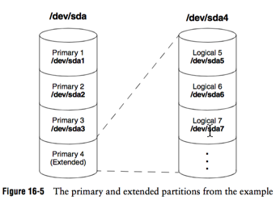

# Preface

面向开发的Ubuntu Linux快速学习手册，掌握基本Ubuntu Linux操作和管理


# Glossary

- **PG2UL**: 代表Pratical Guide to Ubuntu Linux, 3rd


# Install Ubuntu Linux

## 目标

- 安装Ubuntu Desktop 12.04和Ubuntu Server 12.04

## 内容

- 概念
    - Ubuntu各个release版本的区别
        - 如何查看Ubuntu的版本和Linux内核版本
            - `cat /etc/issue`
            - `sudo lsb_release -a`
            - `uname -r`
            - 执行结果见下图：  
                
        - LTS release：long-term support，比如14.04的支持的有效期为5年
    - Ubuntu每个release的不同edition的区别(参考PG2UL, page 32)
        - DVD: The DVD is a live/install DVD. The DVD includes all software packages supported by Ubuntu, not just those installed by default.
        - Desktop CD: The Desktop CD is a live/install CD
        - Alternate CD: The Alternate Install CD is not a live CD; it is intended for special installations only. It presents more advanced installation options than the Desktop CD does. This CD is available for PC and 64-bit PC architectures (page 29), uses the textual installer, and installs an Ubuntu system that displays either a graphical or a textual interface.
        - Server CD: The Server CD is not a live CD; it is intended for installation only.
        - Minimal CD: Not an official edition, the Minimal CD is small (5–20 megabytes) and provides a quick installation.
    - Linux下的各种文件系统的区别
        - [Ext2、Ext3和Ext4之间的区别](http://misujun.blog.51cto.com/2595192/883949)
    - Linux目录层级结构，及常见目录(参考PG2UL, page 39)
    ```bash
    rwxr-xr-x   2 root root  4096 Jul 28 11:46 bin/
    drwxr-xr-x   3 root root  4096 Jul 28 10:28 boot/
    drwxr-xr-x  17 root root  4240 Jul 28 11:48 dev/
    drwxr-xr-x  90 root root  4096 Jul 28 18:25 etc/
    drwxr-xr-x   3 root root  4096 May 10 02:02 home/
    drwxr-xr-x  21 root root  4096 May 10 02:01 lib/
    drwxr-xr-x   2 root root  4096 Jul  8 01:10 lib64/
    drwx------   2 root root 16384 May 10 01:56 lost+found/
    drwxr-xr-x   4 root root  4096 May 10 01:56 media/
    drwxr-xr-x   2 root root  4096 Apr 11  2014 mnt/
    drwxr-xr-x   2 root root  4096 Feb 19 03:33 opt/
    dr-xr-xr-x 407 root root     0 Jul 28 11:48 proc/
    drwx------   2 root root  4096 May 10 01:56 root/
    drwxr-xr-x  18 root root   680 Jul 28 18:26 run/
    drwxr-xr-x   2 root root 12288 Jul 28 11:46 sbin/
    drwxr-xr-x   2 root root  4096 Feb 19 03:33 srv/
    dr-xr-xr-x  13 root root     0 Jul 28 17:24 sys/
    drwxrwxrwt   2 root root  4096 Jul 28 19:17 tmp/
    drwxr-xr-x  10 root root  4096 May 10 01:56 usr/
    drwxr-xr-x  12 root root  4096 May 10 02:01 var/
    ```
    - Mount Points (参考PG2UL, page 35)
        - The directory that you mount a filesystem on is called a mount point.
        - 通过`mount`命令查看分区
        - `/etc/fstab`: The file that holds the information relating partitions to mount points
    - Primary, extended and logical partitions
        - 参考PG2UL, page 34，把这三个概念讲的很清楚  
            
    - LVM: Logical Volume Manager
        - 阅读[浅谈Linux磁盘存储管理续](http://ixdba.blog.51cto.com/2895551/562111/)
        - 阅读[LVM (简体中文) - ArchLinux Wiki](https://wiki.archlinux.org/index.php/LVM_%28%E7%AE%80%E4%BD%93%E4%B8%AD%E6%96%87%29)
        - 阅读[RAID](https://wiki.archlinux.org/index.php/RAID)
        - 阅读[Software RAID and LVM](https://wiki.archlinux.org/index.php/Software_RAID_and_LVM)
- 实践
    - 手动安装Ubuntu Desktop 14.04
    - 手动安装Ubuntu Server 14.04
    - 自动化安装Ubuntu Linux
        - [Preboot Execution Environment](https://en.wiki2.org/wiki/Preboot_Execution_Environment)
        - [Cobbler Quickstart Guide](http://www.cobblerd.org/manuals/quickstart/)
        - [运维自动化之Cobbler系统安装详解](http://os.51cto.com/art/201109/288604_all.htm)

## Shell基本命令

- `df`: 检查linux服务器的文件系统的磁盘空间占用情况
    - 参考 [每天一个linux命令（33）：df 命令](http://www.cnblogs.com/peida/archive/2012/12/07/2806483.html)
- `du`: 查看使用空间的，但是与df命令不同的是Linux du命令是对文件和目录磁盘使用的空间的查看
    - 参考 [每天一个linux命令（34）：du 命令](http://www.cnblogs.com/peida/archive/2012/12/10/2810755.html)


# Basic Shell Knowledge

## 目标

- 掌握Shell基本概念
- 掌握基本的Shell命令

## 内容

- 基础概念
    - [重定向](http://www.php100.com/html/webkaifa/Linux/2010/0430/6470.html): the various ways you can cause the shell to alter where standard input of a command comes from and where standard output goes to.
        - 理解符号 `<`, `>`, `>>`
    - [管道](http://wenku.baidu.com/view/5a7aeff4f61fb7360b4c65ba.html): The shell uses a pipe to connect standard output of one command to standard input of another command.
        - 理解符号 `|`
        - 理解filter: A filter is a command that processes an input stream of data to produce an output stream of data. 比如`sort`、`tee`。
    - 通配符`?`, `*`, `[]`
        - `ls memo?`
        - `ls t*`
        - `lpr part[01235]`, `lpr part[0-35]`, `ls *[^ab]`
- 推荐的Shell
    - 一般Linux发行版默认的shell是bash，但这里推荐Linux推荐安装zsh + [oh-my-zsh](http://ohmyz.sh/)，理由如下：
        - zsh vs bash
            - [Zsh和Bash，究竟有何不同](https://www.soimort.org/posts/163/)
            - [Zsh shell-for-humans](http://www.slideshare.net/juandebravo/zsh-shellforhumans-27933808?related=2)
            - [Why zsh is Cooler than Your Shel](http://www.slideshare.net/brendon_jag/why-zsh-is-cooler-than-your-shell?related=1)
        - 安装oh-my-zsh
            - 先确认os中是否安装了zsh，如果没有安装，先安装zsh, `sudo apt-get install zsh`
            - 按照[http://ohmyz.sh/](http://ohmyz.sh/)的方法安装oh-my-zsh
            - 如果安装完成后，默认的shell不是zsh，按照如下操作：
                - 执行`sudo chsh -s /bin/zsh`
                - 重启系统，打开terminal，oh-my-zsh就生效了
    - Windows下安装[Xshell](http://www.netsarang.com/products/xsh_overview.html)（其次是SecureCRT，Putty）
    - MacOS下安装[oh-my-zsh](http://ohmyz.sh/), [iTerm2](https://www.iterm2.com/index.html), [Tmux](http://tmux.sourceforge.net/)
        - [TMUX Rocks!](http://www.slideshare.net/chenkaie/tmux-rocks)
- 在后台进程管理，
    - 参考[Linux后台进程管理](http://blog.csdn.net/fengyifei11228/article/details/5737371)
        - `ls -l | lpr &`
        - Control-Z: You can suspend a foreground job (stop it from running) by pressing the suspend key, usually CONTROL-Z. The shell then stops the process and disconnects standard input from the keyboard. You can put a suspended job in the background and restart it by using the `bg` command followed by the job number. You do not need to specify the job number when there is only one stopped job.
        - `jobs`: view background jobs
        - `fg`: connect the key-board to a program running in the background, bring it to the fore- ground.
        - `kill`: kill process like `kill 18228`, kill background job like `kill %1`

## Shell基本命令

- `man`: display system manual
- `apropos`: search the whatis database for stringss
- `info`, `pinfo`: a menu-based hypetext system
- `sudo`: 账号间的切换、提权至root
- Base Utilites:
    - `ls`: list the names of files
    - `cat`: display a text files
    - `rm`: delete a files
    - `less`, `more`: display a text file one screen at a time
- Working with files:
    - `cp`: copy file
    - `mv`: move file, change the name of file
    - `head`: diplay the beginning of a file
    - `tail`: display the end of a file，参考[tail命令](http://www.cnblogs.com/peida/archive/2012/11/07/2758084.html)
    - `sort`: sort lines of text，参考[sort命令](http://roclinux.cn/?p=1350)
    - `uniq`: remove duplicate lines from a file，参考[uniq命令](http://www.linuxso.com/command/uniq.html)
    - `diff`: compare two files，参考[diff命令](http://www.cnblogs.com/peida/archive/2012/12/12/2814048.html)
    - `file`: determine file type
- find something
    - `find`: walk a file hierarchy, [每天一个linux命令（19）：find 命令概览](http://www.cnblogs.com/peida/archive/2012/11/13/2767374.html)
    - find filenames quickly
        - `mlocate`: ubuntu, centos下使用此命令，使用前需要执行`updatedb`命令创建`/var/lib/mlocate/mlocate.db`索引文件
        - `locate`: MacOS使用此命令，使用前需要执行`sudo launchctl load -w /System/Library/LaunchDaemons/com.apple.locate.plist`创建`/var/db/locate.database`索引文件
    - `which`, whereis: locate a utility
    - `grep`: [每天一个linux命令（39）：grep 命令](http://www.cnblogs.com/peida/archive/2012/12/17/2821195.html)
    - `ack`: a tool like grep, optimized for programmers
        - [Offical website](http://beyondgrep.com/)
- manipulate text
    - `awk`: awk是一个强大的文本分析工具，相对于grep的查找，sed的编辑，awk在其对数据分析并生成报告时，显得尤为强大。
        - [linux awk命令详解](http://www.cnblogs.com/ggjucheng/archive/2013/01/13/2858470.html)
        - [simple awk tutorial](http://www.hcs.harvard.edu/~dholland/computers/awk.html)
    - `sed`: edit text
        - [linux中sed的用法](http://www.cnblogs.com/emanlee/archive/2013/09/07/3307642.html)
- 更多命令
    - `echo`: display text
    - `date`: display the time and date，参考[date命令](http://www.cnblogs.com/peida/archive/2012/12/12/2814048.html)


# Install and Manage Packages

## 目标
- 安装和管理包

## 内容
- `dpkg`, `apt`, `aptitude`
    - 参考[包管理系统指南](http://wiki.ubuntu.org.cn/包管理系统指南)
    - 参考PG2UL, page 517, chapter 13 - downloading and installing software
    - Ubuntu desktop 14.04中，并没有默认安装aptitude，需要执行`sudo apt-get install aptitude`来安装
    - apt的命令包含：
        - apt-get
        - apt-cache
        - apt-file
- `git`
    - 安装git。如果已安装，忽略。
    - 在命令行下使用git获取、创建分支、提交、合并代码
    - 阅读[Pro Git (En)](https://git-scm.com/book/en/v2)， [Pro Git中文版](http://iissnan.com/progit/)
- `wget`
    - 安装wget。如果已安装，忽略。
    - 学习使用wget
    - 在线html文档，访问[wget html document](http://www.gnu.org/software/wget/manual/wget.html)
- `vim`
    - 安装vim
    - Ubuntu Desktop 14.04 默认没有安装Vim


# SSH

## 目标

- 远程控制linux
- Shell基本命令

## 内容

- SSH
    - [SSH原理与运用（一）](http://www.ruanyifeng.com/blog/2011/12/ssh_remote_login.html)
    - [SSH原理与运用（二）](http://www.ruanyifeng.com/blog/2011/12/ssh_port_forwarding.html)
    - [OpenSSH-Server(Ubuntu Server Document)](https://help.ubuntu.com/lts/serverguide/openssh-server.html)
    - [25个必须记住的SSH命令](http://os.51cto.com/art/201011/235252.htm)
    - [mac下SSH免密码登录远程服务器](http://cssor.com/mac-ssh-auto-login-server.html)
- 终端与本地文件的传输
    - `scp`: [详解linux scp命令的应用](http://os.51cto.com/art/201003/187301.htm)
    - 除了scp的其它文件传输方法：sftp，sshfs, rsync，参考 [how-to-copy-files-from-one-machine-to-another-using-ssh](http://unix.stackexchange.com/questions/106480/how-to-copy-files-from-one-machine-to-another-using-ssh#)
- 了解Linux下的语言编码、文件编码、终端编码之间的关系
    - [Linux下查看文件编码，文件或文件名编码格式转换](http://blog.sina.com.cn/s/blog_6fe0d70d0101du41.html)
    - [Linux中文乱码解决办法](http://www.mutouxiaogui.cn/blog/?p=21)
    - [Linux终端中文显示乱码](http://skypegnu1.blog.51cto.com/8991766/1545449)
- 实践
    - SSH
        - 在Ubuntu Server安装openssh-server
        - 在客户端操作系统上通过SSH连接Ubuntu Server
            - Mac OS X上使用Terminal
            - Windows上使用Putty、Xshell
            - Ubuntu上安装openssh-client
    - scp
        - 通过scp向server传送文件
        - 通过scp从server获取文件
    - [让进程在断开SSH连接后依然保持运行](https://www.ibm.com/developerworks/cn/linux/l-cn-nohup/)

## Shell基本命令

- `script`: record a shell session
- `todos`, `fromdos`: convert linux and macos files to windows format


# Basic Vim Usage

## 目标
- 掌握Vim基本操作

## 熟悉Vim

- 阅读[vim基本操作](./vim基本操作.md)


# File, Directory, User, User Group, Authority

## 目标

- 文件、目录、用户、用户组、权限
- Shell基本命令

## 内容

- Linux下的用户与组的关系、如何管理用户和组
    - [Linux用户和用户组管理](http://www.chinaunix.net/old_jh/4/438660.html)
    - [浅谈Linux用户权限管理之一（用户与组的概念）](http://ixdba.blog.51cto.com/2895551/531787/)
    - [浅谈Linux用户权限管理之二（用户管理工具）](http://ixdba.blog.51cto.com/2895551/531793)
    - [浅谈Linux用户权限管理之三（文件与权限的设定）](http://ixdba.blog.51cto.com/2895551/531799)
    - [Users and Groups](https://wiki.archlinux.org/index.php/Users_and_groups)
    - [Linux: Show The Groups a User Is In](http://www.cyberciti.biz/faq/linux-show-groups-for-user/)
- 文件及目录的权限及含义，如何快速计算目录权限
    - `chmod`: change file modes or Access Control Lists
    - `chown`: change file owner or group
    - `ls -l`: display file permissions
    - `cd`: [每天一个linux命令(2)：cd命令](http://www.cnblogs.com/peida/archive/2012/10/24/2736501.html)
    - 目录访问权限一些特殊的地方
        - Execute permission is redefined for a directory: It means that you can cd into the directory and/or examine files that you have permission to read from in the directory. It has nothing to do with executing a file.
    - 理解ACL
- 系统自带的特殊目录及其作用
    - PG2UL, page 213
    - [Linux系统默认目录](http://blog.chinaunix.net/uid-30093414-id-4797285.html)
    - [Linux的学习--系统目录](http://www.cnblogs.com/CraryPrimitiveMan/p/4444037.html)
- 理解硬链接（hard link）和符号链接（Symbolic link）
- 文件类型与扩展名
    - [Linux文件类型与扩展名](http://www.cnblogs.com/peida/archive/2012/11/22/2781912.html)
    - PG2UL, page 501, Device Special Files
- Obtaining user and system information
    - `who`: list users on the system
    - `finger`: list users on the system
    - `w`: list users on the system
    - `hostname`: display the system name

# Compress and Uncompress Files

## 目标

- 熟悉文件的压缩和解压

## 内容

- 阅读PG2UL， page 174, Compressing and archiving files
- [rar tar gz zip 7z 有什么区别?](http://www.zhihu.com/question/26026741)
- bzip2压缩
    - `bzip2`: compress a file
    - `bunzip2`: uncompress a file
    - `bzcat`: decompresses the compressed data and displays the decompressed data
    - `bzip2recover`: supports limited data recovery from media errors
- gzip压缩
    - `gzip`: compresses a file
    - `gunzip`
    - `zcat`
- xz压缩
    - [XZ utils](http://tukaani.org/xz/) : XZ Utils is free general-purpose data compression software with high compression ratio. XZ Utils were written for POSIX-like systems, but also work on some not-so-POSIX systems. XZ Utils are the successor to LZMA Utils. The core of the XZ Utils compression code is based on LZMA SDK, but it has been modified quite a lot to be suitable for XZ Utils. The primary compression algorithm is currently LZMA2, which is used inside the .xz container format. With typical files, XZ Utils create 30 % smaller output than gzip and 15 % smaller output than bzip2.
    - `xz`
    - `unxz`
    - `xzcat`
- 7zip压缩
    - [7zip](http://www.7-zip.org/download.html)
    - linux、freebsd、macos下的port是p7zip，ubuntu下执行`sudo apt-get install p7zip-full`安装
    - 参考
        - [linux下的压缩解压软件7zip](http://www.linuxdiyf.com/viewarticle.php?id=193969)
        - [How to use 7zip on Linux command Line](https://www.ibm.com/developerworks/community/blogs/6e6f6d1b-95c3-46df-8a26-b7efd8ee4b57/entry/how_to_use_7zip_on_linux_command_line144?lang=en)
        - [p7zip - archlinux document](https://wiki.archlinux.org/index.php/P7zip)
- zip压缩
    - zip
    - unzip
- rar压缩
    - unrar
- `tar`: manipulate tape archives


# Process

## 目标

- 进程
- 进程控制
- 守护进程（daemon）和服务（service）

## 内容

- 基础概念
    - 进程
        - 进程号、父子进程关系
        - 僵尸进程: [Linux僵尸进程](http://coolshell.cn/articles/656.html)
        - 孤儿进程: [孤儿进程与僵尸进程](http://www.cnblogs.com/anker/p/3271773.html)
        - [信号](http://www.cnblogs.com/taobataoma/archive/2007/08/30/875743.html)
    - 守护进程和服务
        - 概念上的区别：系统为了某些功能必须要提供一些服务 (不论是系统本身还是网络方面)，这个服务就称为 service。但是service的提供总是需要程序的运行吧！达成这个service的程序我们就称呼他为daemon！举例来说，达成循环型例行性工作排程服务 (service) 的程序为 crond 这个 daemon ！
        - daemon主要分为：
            - stand_alone，可以自行单独启动服务
            - super daemon，由一个特殊的 daemon 来统一管理
        - 参考
            - 阅读[鸟哥的Linux私房菜-认识系统服务](http://vbird.dic.ksu.edu.tw/linux_basic/0560daemons.php)
- 实践
    - 通过/proc查看系统运行信息
        - [深入理解linux系统下proc文件系统内容](http://www.cnblogs.com/cute/archive/2011/04/20/2022280.html)
        - [使用 /proc 文件系统来访问 Linux 内核的内容](http://www.ibm.com/developerworks/cn/linux/l-proc.html)
    - 观察系统启动的服务
        - `netstat -tulp`: 找出目前系统开启的『网络服务』
        - `netstat -lnp`: 找出所有的有监听网络的服务 (包含 socket 状态)
        - `service --status-all`: 观察所有的服务状态
    - 通过`/etc/init.d`目录下的脚本控制服务
        - 用法：`Usage: /etc/init.d/networking {start|stop|reload|restart|force-reload}`
    - 通过`service`命令控制服务
        - `sudo service [service name] {start|stop|restart|status}`

## Shell基本命令

- `vmstat`: Report virtual memory statistics
- `ps`: 使用PS查看进程信息，了解每一列的含义，掌握其参数
    - 参考 [每天一个linux命令（41）：ps命令](http://www.cnblogs.com/peida/archive/2012/12/19/2824418.html)
- `top`: 使用top查看系统负载，了解每一列的含义
    - 参考 [每天一个linux命令（44）：top命令](http://www.cnblogs.com/peida/archive/2012/12/24/2831353.html)
- `htop`: an interactive process viewer for Linux
    - [Linux下取代top的进程管理工具 htop](http://www.cnblogs.com/mchina/archive/2013/03/15/2858041.html)
    - [htop - an interactive process viewer for Linux](http://hisham.hm/htop/index.php?page=main)
- `kill`: 通过kill给进程发送信号
    - 参考[每天一个linux命令（42）：kill命令](http://www.cnblogs.com/peida/archive/2012/12/20/2825837.html)
    - [Linux进程间通信——使用信号](http://blog.csdn.net/ljianhui/article/details/10128731)
- `lsof`: lsof（list open files）是一个列出当前系统打开文件的工具。在linux环境下，任何事物都以文件的形式存在，通过文件不仅仅可以访问常规数据，还可以访问网络连接和硬件。所以如传输控制协议 (TCP) 和用户数据报协议 (UDP) 套接字等，系统在后台都为该应用程序分配了一个文件描述符，无论这个文件的本质如何，该文件描述符为应用程序与基础操作系统之间的交互提供了通用接口。因为应用程序打开文件的描述符列表提供了大量关于这个应用程序本身的信息，因此通过lsof工具能够查看这个列表对系统监测以及排错将是很有帮助的。
    - 参考[每天一个linux命令（51）：lsof命令](http://www.cnblogs.com/peida/archive/2013/02/26/2932972.html)


# Basic Network Management

## 目标

- 查看网络状态与基本网络管理

## Basic Network Management

- 概念
    - [基础网络概念](http://vbird.dic.ksu.edu.tw/linux_server/0110network_basic.php)
    - 网络协议的层次结构
        - 参考[互联网协议入门（一）](http://www.ruanyifeng.com/blog/2012/05/internet_protocol_suite_part_i.html)
        - 参考[互联网协议入门（二）](http://www.ruanyifeng.com/blog/2012/06/internet_protocol_suite_part_ii.html)
        - 参考[TCP IP网络协议图](./file/TCP-IP_Network_Protocol_Diagram.pdf)
    - IP协议，IP地址的分类，子网掩码
        - [如何理解ip路由和操作linux的路由表](http://linux.chinaunix.net/techdoc/net/2008/09/18/1033149.shtml)
    - TCP协议
    - UDP协议
    - PPP协议
- 网络工具
    - 使用Vim修改/etc/hosts
    - 常用文件传输方式及比较
        - [Linux 上的常用文件传输方式介绍与比较](http://www.ibm.com/developerworks/cn/linux/l-cn-filetransfer/)
        - [linux下不同服务器间数据传输(rcp,scp,rsync,ftp,sftp,lftp,wget,curl)](http://blog.csdn.net/emili/article/details/6858818)
    - [Linux常用网络指令](http://linux.vbird.org/linux_server/0140networkcommand.php)
    - [linux网络配置命令之ifconfig、ip和route](http://chrinux.blog.51cto.com/6466723/1188108)
    - [Linux and Unix ifconfig command](http://www.computerhope.com/unix/uifconfi.htm)

## Shell命令

- `ifconfig`
    - 参考[每天一个linux命令（52）：ifconfig命令](http://www.cnblogs.com/peida/archive/2013/02/27/2934525.html)
    - 参考[Linux and Unix - ifconfig command](http://www.computerhope.com/unix/uifconfi.htm)
- `telnet`
    - 参考[Linux and Unix - telnet command](http://www.computerhope.com/unix/utelnet.htm)
- `ping`: use ICMP
    - 参考[ping结果中TTL是什么意思](http://www.ezloo.com/2007/05/ping_ttl.html)
    - 参考[ping 命令详解](http://zhidao.baidu.com/question/13855241.html)
- `traceroute`: traces a route over the internet
    - 参考[每天一个linux命令（55）：traceroute命令](http://www.cnblogs.com/peida/archive/2013/03/07/2947326.html)
- `nslookup`, `host`, `dig`: DNS lookup utility
    - 参考[Linux and Unix - nslookup command](http://www.computerhope.com/unix/unslooku.htm)
    - 参考[Linux and Unix - host command](http://www.computerhope.com/unix/host.htm)
    - 参考[Linux and Unix - dig command](http://www.computerhope.com/unix/dig.htm)
- `whois`: look up information about a internet site
    - 参考[Linux and Unix - whois command](http://www.computerhope.com/unix/uwhois.htm)
    - [站长之家 - whois查询](http://whois.chinaz.com/)
    - [Godaddy whois查询](https://who.godaddy.com/)
- `netstat`:
    - 参考[每天一个linux命令（56）：netstat命令](http://www.cnblogs.com/peida/archive/2013/03/08/2949194.html)
- `ip`
    - 参考[Linux and Unix - ip command](http://www.computerhope.com/unix/ip.htm)
- `iptables`: iptables is a user-space application program that allows a system administrator to configure the tables provided by the Linux kernel firewall (implemented as different Netfilter modules) and the chains and rules it stores. Different kernel modules and programs are currently used for different protocols; iptables applies to IPv4, ip6tables to IPv6, arptables to ARP, and ebtables to Ethernet frames.
    - 参考[百度百科-iptables](http://baike.baidu.com/view/504557.htm#1_1)
    - 参考[wikipedia - iptables](https://en.wiki2.org/wiki/Iptables) 

# Writing Shell Scripts

## 目标

- Shell的基本概念及启动过程
- 编写Shell脚本

## Writing Shell Scripts

- 基本概念
    -  login shell vs nonlogin shell, interactive shell vs noninteractive shell
        - Login shells: `/etc/profile`, `.bash_profile`, `.bash_login`, `.profile`, `.bash_logout`
        - Interactive nonlogin shells: `/etc/bashrc`, `.bashrc`
        - Noninteractive shells: `BASH_ENV`
        - [交互式shell和非交互式shell、登录shell和非登录shell的区别](http://smilejay.com/2012/10/interactive-shell-login-shell/)
    - Builtin commands that are symbols
        - `()`: subshell
        - `$()`: command substitution
        - `(())`: arithmetic evaluation
        - `$(())`: arithmetic expansion
        - `[]`: test command
        - `[[]]`: conditional expression
    - 必读：[Use the Unofficial Bash Strict Mode (Unless You Looove Debugging)](http://redsymbol.net/articles/unofficial-bash-strict-mode/)
- 语法
    - 参考：见PG2UL, page 953
    
## Shell命令

- `export`
- `source`
- `xargs`: construct argument list(s) and execute utility
    - [Example xargs](http://examplenow.com/zh-cn/xargs/man1)
    - [10 Xargs Command Examples in Linux / UNIX](http://www.thegeekstuff.com/2013/12/xargs-examples/)


# Schedule Tasks

## 目标

- 掌握cron和anacron

## 内容

- 阅读PG2UL，page 605，Scheduling Tasks
- 阅读 [crontab 定时任务](http://linuxtools-rst.readthedocs.org/zh_CN/latest/tool/crontab.html)
- [linux定时任务的设置](http://www.taobaotest.com/blogs/1506)


# Futher Reading

## Knowledge

- [The art of command line](https://github.com/jlevy/the-art-of-command-line)
- [Linux Tools Quick Tutorial](http://linuxtools-rst.readthedocs.org/zh_CN/latest/index.html)
- [每天一个linux目录](http://www.cnblogs.com/peida/archive/2012/12/05/2803591.html)

## Utilites

- [Awesome Shell](https://github.com/alebcay/awesome-shell)
- [Explain Shell](http://explainshell.com/)

# FAQ

## 如何安装中文语言支持（System Settings -> Language Support）及中文输入法（System Settings -> Text Entry）

[Ubuntu上的输入法情况](http://wiki.ubuntu.org.cn/%E4%B8%AD%E6%96%87%E8%BE%93%E5%85%A5%E6%B3%95):

> Ubuntu上有IBus、Fcitx等开源的输入法框架，支持各种各样的引擎。  
> Rime（中州韵输入法引擎）是一种流行的开源跨平台输入法，支持IBus和Fcitx框架。  
> 搜狗输入法在2014年4月发布了Linux版本，使用Fcitx框架。  
> 免费但不开源的小小输入法，也提供对Ubuntu的支持。  
> 作为Chrome扩展的输入法：Google Input Tools  
> 作为Firefox扩展的输入法：火输(Fireinput)。  
> 可以直接在浏览器中使用的云输入法：搜狗云输入法、QQ云输入法等。

目前比较推荐Linux上的搜狗输入法：[下载地址](http://pinyin.sogou.com/linux/?r=pinyin)

搜过拼音的安装方法：

- [Ubuntu 14.04安装搜狗拼音linux版应该注意的问题](http://blog.csdn.net/tao_627/article/details/24119037)
- [Ubuntu下安装搜狗拼音输入法](http://blog.csdn.net/rflyee/article/details/9472579)

## 如何升级系统，安装最新的补丁和最新版本的软件

GUI操作

1. System Settings -> Softwares&Updates -> Select best download server，选择最佳的软件更新服务器
1. 然后按Alt+F2组合键调出运行命令框，然后键入`update-manager -d`，然后升级系统

终端操作

1. 执行下面的命令，安装最新的系统补丁：`sudo apt-get update && sudo apt-get dist-upgrade`

## 修改Ubuntu Software Repository的下载地址，比如把下载地址改为国内的repository服务地址

参考：

1. GUI操作参考[Linux开发环境搭建与使用——ubuntu更新设置](http://blog.csdn.net/tennysonsky/article/details/44221433)
1. Bash操作参考：[Repositories/CommandLine](https://help.ubuntu.com/community/Repositories/CommandLine)

Ubuntu uses apt for package management. Apt stores a list of repositories or software channels in the file

```bash
/etc/apt/sources.list
```

and in any file with the suffix .list under the directory

```bash
/etc/apt/sources.list.d/
```

See `man sources.list` for more about this storage mechanism.

By editing these files from the command line, we can add, remove, or temporarily disable software repositories.

## 如何给Ubuntu Linux Virutal Machine安装VMWare Tools

- 安装方法参考
    - [Installing VMware Tools in an Ubuntu virtual machine (1022525)](http://kb.vmware.com/selfservice/microsites/search.do?cmd=displayKC&docType=kc&externalId=1022525)
- 卸载方法参考
    - [Uninstalling and manually installing VMware Tools in VMware Fusion (1014522)](http://kb.vmware.com/selfservice/microsites/search.do?cmd=displayKC&docType=kc&externalId=1014522&sliceId=1&docTypeID=DT_KB_1_1&dialogID=672738403&stateId=1%200%20672744194)
    - [VMware Tools Uninstaller in Ubuntu Guest Does Not Remove vmxnet Module (1004351)](http://kb.vmware.com/selfservice/microsites/search.do?cmd=displayKC&docType=kc&externalId=1004351&sliceId=1&docTypeID=DT_KB_1_1&dialogID=672738403&stateId=1%200%20672744194)

## 如何给Ubuntu Linux Virtual Machine安装Parallel Tools

参考[How do I install Parallels Tools in Ubuntu Virtual Machine?](http://kb.parallels.com/en/113394)

## 给Ubuntu安装SSH服务

ubuntu默认并没有安装ssh服务，如果通过ssh链接ubuntu，需要自己手动安装ssh-server。

- [Ubuntu Document - OpenSSH 服务器](https://help.ubuntu.com/lts/serverguide/openssh-server.html)
- [ubuntu下如何安装使用SSH？](http://os.51cto.com/art/201109/291634.htm)

## 使用命令`man wget > man-wget.txt`把命令文档输入到文本文件后，打开man-wget.txt，发现有很多重复字符，或者乱码？

将man手册查询命令输出到文本文件中，要求过滤掉控制字符^H（Backspace (退格)）  

`man chmod |col –b >/home/man_chmod.txt`

col命令的使用方法见[col命名详解](http://myblog.jyc.edu.cn/?p=62)

## 如何修改OS的hostname

参考[How do I change the hostname without a restart?](http://askubuntu.com/questions/87665/how-do-i-change-the-hostname-without-a-restart)

`hostname`临时保存在内存，永久保存在`/etc/hostname`文件中，同时`/etc/hosts`文件中也配置了`hostname`对应的IP地址

- 查看主机名`hostname`
- 临时修改主机名，命令执行后即时生效`sudo hostname [yourhostname]`，重启后依然恢复原hostname
- 永久修改主机名，将新的主机名写入，重启系统后生效`sudo vim /etc/hostname`
- `hostnamectl`命令包含了临时修改hostname和修改`/etc/hostname`两种操作，但是不会修改`/etc/hosts`，所以执行`hostnamectl`命令后还需要手动修改`/etc/hosts`文件  

```bash
hostnamectl set-hostname new-hostname
``` 

## 设置DNS服务的服务地址

编辑保存DNS信息的配置文件

```bash
sudo pico /etc/resolv.conf
```

最多可以使用3个DNS地址，内容如下

```bash
nameserver xxx.xxx.xxx.xxx  nameserver xxx.xxx.xxx.xxx  nameserver xxx.xxx.xxx.xxx
```

对resolv.conf文件的修改是即时生效的，可以使用nslookup命令进行查询。

## 如何配置网卡和IP地址

ubuntu的网络配置信息放在`/etc/network/interfaces`中，

```bash
sudo vim /etc/network/interfaces
```

要通过dhcp获取ip，则添加如下内容：

```bash
auto eth0
iface eth0 inet dhcp
```

如果配置静态ip，则添加如下内容：

```bash
auto eth0
iface eth0 inet static
    address 192.168.1.201
    netmask 255.255.255.0
    gateway 192.168.1.1
```

需重启下网络服务使配置生效

```bash
sudo /etc/init.d/networking restart
```
## 如何从Internet更新ubuntu本地的时间？

You can do so with `sudo ntpdate time.nist.gov` other servers include time.windows.com, etc.
http://www.pool.ntp.org/ lists time servers around the world.

## 切换网络后，如何强制更新网卡IP？

To renew or release an IP address for the eth0 interface, enter:

```bash
$ sudo dhclient -r eth0
$ sudo dhclient eth0
```
